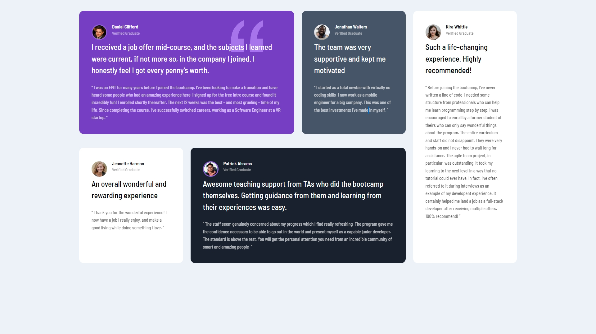

# Frontend Mentor - Testimonials grid section solution

This is a solution to the [Testimonials grid section challenge on Frontend Mentor](https://www.frontendmentor.io/challenges/testimonials-grid-section-Nnw6J7Un7). Frontend Mentor challenges help you improve your coding skills by building realistic projects. 

## Table of contents

- [Overview](#overview)
  - [The challenge](#the-challenge)
  - [Screenshot](#screenshot)
  - [Built with](#built-with)
  - [What I learned](#what-i-learned)
- [Author](#author)
- [Acknowledgments](#acknowledgments)

## Overview

### The challenge

Users should be able to:

- View the optimal layout for the site depending on their device's screen size

### Screenshot



### Built with

- Semantic HTML5 markup
- CSS custom properties
- Flexbox
- CSS Grid
- Desktop-First workflow

### What I learned


I mostly used (https://www.youtube.com/watch?v=0xMQfnTU6oo&t=2207s) to help me build this project. I basically watched the whole thing over once and then tried to build it myself. 

I learned how to nest elements inside each other appropriately like in the example below (in this case for a card) and that I should look ahead. For example, with the HTML below, i made the header a flexbox, meaning I needed to structure the child elements accordingly to get the result I wanted

```html
div class="card grey-blue-bg">
            <header class="card-header">
                
                <div>
                    <h3></h3>
                    <p></p>
                </div>
            </header>
            <div class="lead"></div>
            <div class="quote"></div>
```
As for CSS, there wasn't much CSS that I used in this project that I wasn't familiar with except from CSS Grid. This project was a gateway for me to learn how to use CSS grid as easily as possible
The key things I would like to remember is:
```css
grid-template-columns:;
grid-template-rows:;
gap:;
grid-column: #/#;
grid-row: #/#;
```

## Author

- Website - [Huang Hao Gao](https://www.your-site.com)
- Frontend Mentor - [@Huang-Hao-Gao](https://www.frontendmentor.io/profile/yourusername)

## Acknowledgments

(https://www.youtube.com/c/TraversyMedia)
Using these videos has probably been the most helpful thing that I've done since starting to learn HTML and CSS somewhere around January 2022. If you're going to learn anything front-end related, then watch this guy's videos as I will be aswell.
